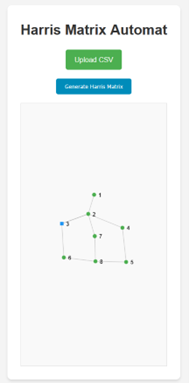
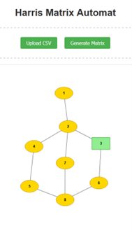
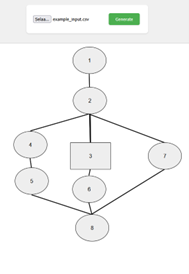
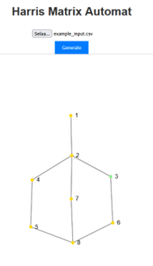
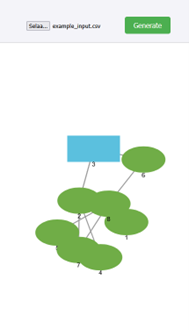
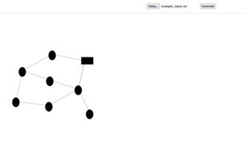

# Ohjelmointia osaamattomille

Arkeologiaan kuuluu nykyään välttämättömänä pahana tietokoneella istuminen ja erilaisten ohjelmistojen käyttö. Vähintäänkin karttojen ja raporttien laatiminen vaatii päätteellä istumista, puhumattakaan tutkimussuuntauksista, joihin kuuluvat erilaiset analyysit, prosessoinnit ja simuloinnit. Useimmiten näihin käytettävät ohjelmistot eivät ole arkeologeja varten suunniteltuja, minkä vuoksi niiden käyttö vaatii joskus luovuutta ja joustavuutta. Ohjelmistokehitys on hidasta ja kallista, minkä vuoksi harvat arkeologeille tarkoitetut ohjelmistot ovat yleensä arkeologien itsensä kehittämiä. Koodaaminen on kuitenkin vuosien aikana karttuva taito, ja vaikka taitoa olisikin, on käyttökelpoisen ohjelman kirjoittaminen joka tapauksessa hidasta ja monimutkaista puuhaa.

Vaan ei enää! Uusimmat tekoälypohjaiset kielimallit (Large Language Model, LLM) tuottavat niin hyvää koodia, että riittää, kun käyttäjä osaa kuvailla tarkasti sen, mitä haluaa ohjelmiston tekevän. Pieniä koodinpätkiä on helppo tuottaa ja käyttää ChatGPT:n tai muun vastaavan avulla. Kielimallia voi esimerkiksi pyytää kirjoittamaan Powershell-koodia, jolla muuttaa kaikki kansion tiedostonimet seuraamaan tiettyä kaavaa, tai luokitella eri tyyppiset tiedostot omiin kansioihinsa.

Halusin testata eri kielimallien kykyä kirjoittaa kokonainen Internet-selaimessa toimiva pieni ohjelma. Esimerkiksi valikoitui ohjelma, joka tekisi stratigrafisten yksiköiden välisiä suhteita kuvaavan taulukon perusteella Harrisin matriisin. Ideana oli, että kaiken koodin pitäisi mahtua yhteen tiedostoon ja syntyä yhden vastauksen aikana. Testeissä käytettiin seuraavia malleja:

| Julkaisija | Malli | Julkaistu |
|------------|-------|-----------|
| OpenAI | GPT-4o | Toukokuu 2024 |
| Claude (Anthropic) | Haiku 3.5 | Lokakuu 2024 |
| Copilot (Microsoft) | GPT-4 Turbo (Copilot) | 2024 |
| Gemini (Google) | 2.0 Flash | Helmikuu 2025 |
| Cursor | GPT-4o-mini | Heinäkuu 2024 |
| Mistral AI | Mistral small 3.1 | Maaliskuu 2025 |

Niille annettiin seuraava CSV-tiedosto, joka kuvaa yksinkertaisia stratigrafisia relaatioita:

| unitno | type | above | below |
|--------|------|-------|--------|
| 1 | deposit | 2 | |
| 2 | deposit | 3;4;7 | 1 |
| 3 | structure | 2;6 | 2 |
| 4 | deposit | 5 | 2 |
| 5 | deposit | 8 | 4 |
| 6 | deposit | 8 | 3 |
| 7 | deposit | 8 | 2 |
| 8 | deposit | | 5;6;7 |

Minkä jälkeen kielimallille annettiin alla oleva ohjeistussyöte:

```
Create an app called Harris Matrix Automat that allows archaeologists to generate visual Harris matrices from structured stratigraphical data. The user uploads a CSV file, and the app visualizes the stratigraphical relationships between units in a top-down hierarchical graph, with the newest units on top and the oldest at the bottom.
## Example of the CSV input
unitno,type,above,below
1,deposit,2,0
2,deposit,3;4;7,1
3,structure,2;6,2
4,deposit,5,2
5,deposit,8,4
6,deposit,8,3
7,deposit,8,2
8,deposit,,5;6;7

- The "above" and "below" columns may contain multiple values separated by semicolons (;).
- If the "above" or "below" field is empty, it should be treated as no connection in that direction
- The csv file will contain a header that describes the columns

## Technical constraints
- Single-file app: All HTML, CSS, and JavaScript must be contained in a single index.html file. No external .css or .js files
- The game should be build using HTML, CSS and JavaScript
- Core Technologies: Use HTML, CSS, and JavaScript. If needed, you may use a lightweight external library like D3.js for graph visualization
- You will generate your own assets using basic shapes. In the matrix, I want the deposits to be ovals, structures to be rectangles and cuts to be triangles
- The app should be usable on both desktop and mobile devices
- The graph must be top-down, with newer units at the top and older units at the bottom
- Nodes should be spaced automatically to prevent overlap and ensure readability
## Features
- User can input the csv through an upload button
- After the file has been uploaded the user can click "Generate" button to create the Harris matrix image
- The stratigraphical units are connected with lines based on their stratigraphical relationships (above what, below what) as in normal Harris matrix
- The matrix should be interactive so that the user can drag the nodes where they want
- Nodes should be clearly labeled with their unit number.
- The graph should resize dynamically to fit different screen sizes (desktop and mobile).
- Stratigraphic relationships should be visualized with lines connecting nodes (above-below relationships)
- The application includes CSS that makes it look professional and inviting
- The visualization should scale properly for both desktop and mobile devices.


Important: The primary goal is correct interpretation and visualization of the input data. Ensure that the relationships between units are accurately represented in the Harris matrix.
```

Tulokset:

### Claude



- Matriisi piirtyi periaatteessa oikein, joskin kyljellään
- Raahaustoiminto toimii
- Eri yksikkötyypit eritelty väreillä, mutta ei muodoilla
- Koodia: 269 riviä

### Cursor



- Matriisi piirtyi oikein
- Yksikkötyypit eritelty ohjeiden mukaisesti
- Alkuasetelmassa pallukat olivat epämääräisessä kasassa, mutta niitä voi raahata
- Koodia: 278 riviä

### Gemini



- Alkuasetelma: yksikköpallukat päällekkäin, mutta niitä voi raahata
- Linkit oikein
- Rakenneyksikkö tulkittu keskelle jakamaan maayksiköt, mutta voi olla sattumaa
- Koodia: 458 riviä

### Copilot



- Matriisi piirtyi periaatteessa oikein
- Yksikkötyypit eroteltu pelkän värin mukaan
- Generoitui kyljellään, mutta raahaus toimii
- Koodia: 157 riviä

### OpenAI GPT-4



- Yksikkötyypit eritelty oikein
- Linkit näyttävät oikeilta
- Yksiköt epämääräisessä kasassa, ei voi raahata
- Koodia: 272 riviä

### Mistral



- Yksiköiden numerot eivät näy
- Matriisi vaikuttaa oikeelliselta
- Yksikkötyypit eritelty muodon perusteella
- Yksiköitä voi raahata, mutta ne jäävät sivuun
- Koodia: 163 riviä

## Yhteenveto

Kaiken kaikkiaan mallien suoritus on melko hyvä: lopputulokset syntyivät yhdellä tai kahdella ohjeistuksella muutamassa minuutissa. Kaikki ohjelmat toimivat myös isommilla aineistoilla (testasin jokaista esimerkkidatalla jossa oli 28 yksikköä). 

Yhtäkään näistä ei ehkä sellaisenaan kannata käyttää, mutta niiden muokkaaminen ja jatkokehittäminen olisi tarvittaessa helppoa joko koodaamalla itse tai käskemällä kielimalleja tekemään parannuksia.

Eri kielimallien tuottama koodi, syöte sekä esimerkkidata nähtävissä [Github-repositoriossani](https://github.com/nikolaipaukkonen/AvoinArkeologi/tree/main/OhjelmointiaOsaamattomille).
